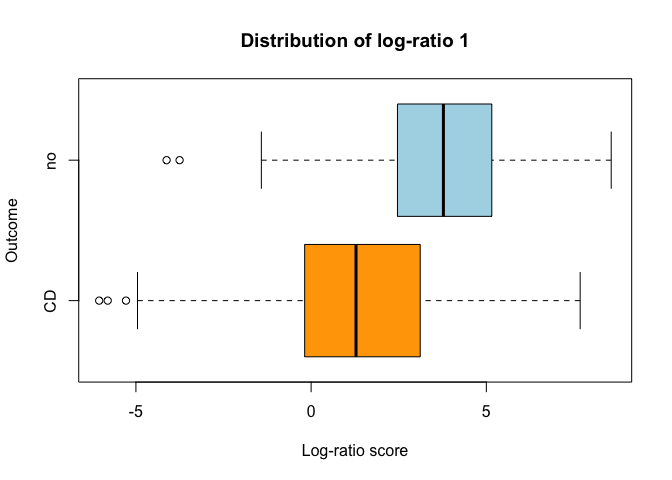
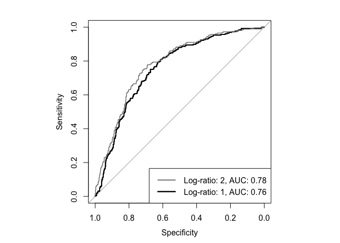
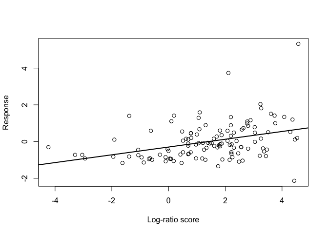
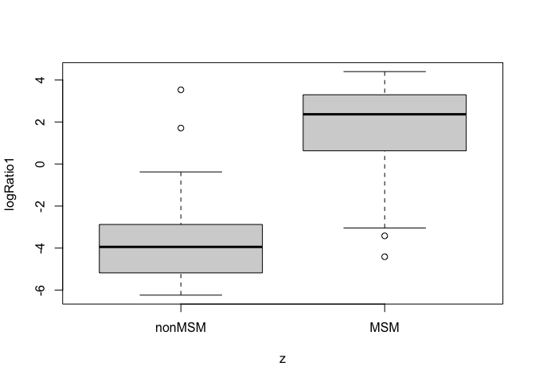
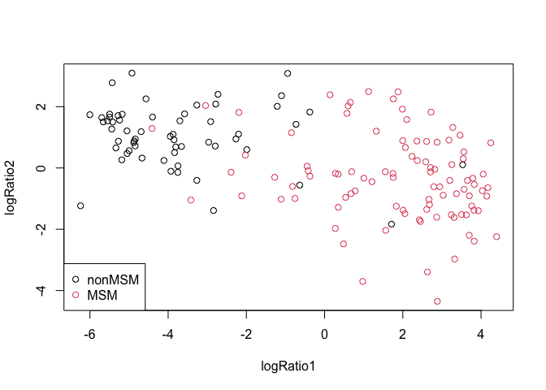
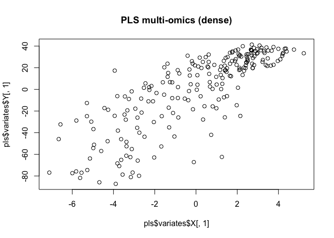
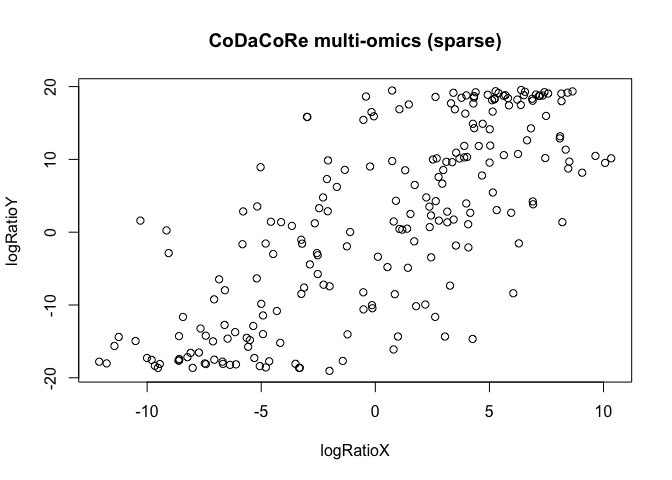

-   [1 Installation](#installation)
-   [2 Summary of method](#summary-of-method)
-   [3 Training the model](#training-the-model)
-   [4 Visualizing results](#visualizing-results)
-   [5 Predicting on new data](#predicting-on-new-data)
-   [6 Controlling overlap between
    log-ratios](#controlling-overlap-between-log-ratios)
-   [7 Using amalgamations
    (summed-log-ratios)](#using-amalgamations-summed-log-ratios)
-   [8 Continuous outcomes](#continuous-outcomes)
-   [9 Tuning lambda](#tuning-lambda)
    -   [9.1 When no predictive log-ratios are
        found](#when-no-predictive-log-ratios-are-found)
-   [10 Covariate adjustment](#covariate-adjustment)
    -   [10.1 Incremental fit](#incremental-fit)
    -   [10.2 Joint fit](#joint-fit)
-   [11 Unsupervised learning](#unsupervised-learning)
-   [12 Multi-omics integration](#multi-omics-integration)

# 1 Installation

You can install `codacore` by running:

    install.packages("codacore")

You may also install the development version directly from Github, using
the [devtools
package](https://www.r-project.org/nosvn/pandoc/devtools.html).

    devtools::install_github("egr95/R-codacore", ref="main")

Note that CoDaCoRe requires a working installation of
[TensorFlow](https://tensorflow.rstudio.com/). If you do not have
Tensorflow previously installed, when you run `codacore()` for the first
time you will likely encounter an error message of the form:

    > codacore(x, y)

    ERROR: Could not find a version that satisfies the requirement tensorflow
    ERROR: No matching distribution found for tensorflow
    Error: Installation of TensorFlow not found.

    Python environments searched for 'tensorflow' package:
     /moto/stats/users/eg2912/miniconda3/envs/r-test/bin/python3.9
     /usr/bin/python2.7

    You can install TensorFlow using the install_tensorflow() function.

This can be fixed simply by [installing
tensorflow](https://tensorflow.rstudio.com/installation/), as follows:

    install.packages("tensorflow")
    library("tensorflow")
    install_tensorflow()

    install.packages("keras")
    library("keras")
    install_keras()

Note also that you may have to restart your R session between
installation of `codacore`, `tensorflow`, and `keras`.

# 2 Summary of method

CoDaCoRe is an algorithm to identify predictive log-ratio biomarkers in
high-throughput sequencing data. Let *x* denote HTS input (e.g.,
*x**i*, *j* denotes the abundance of the *j*th bacteria in
the *i*th subject), and let *y* denote the outcome of interest (e.g.,
*y**i* is equal to 0 or 1 depending on whether the *i*th
subject belonged to the case or the control group). Given a set of
(*x**i*, *y**i*) pairs, CoDaCoRe identifies
predictive biomarkers of the form:
$$
B(x\_i; J^+, J^-) = \\log \\left( \\frac{\\sum\_{j \\in J^+} x\_{i,j}}{\\sum\_{j \\in J^-} x\_{i,j}} \\right),
$$
that are maximally associated with the response variable
*y**i*. In other words, CoDaCoRe identifies a numerator set
*J*+ and a denominator set *J*−, such that their
log-ratio is most predictive of the response variable. By default,
CoDaCoRe uses *balances*, which are defined as the log-ratio of
*geometric means* (as opposed to summations):
$$
B(x\_i; J^+, J^-) = \\log \\left( \\frac{(\\prod\_{j \\in J^+} x\_{i,j})^{|J^+|}}{(\\prod\_{j \\in J^-} x\_{i,j})^{|J^-|}} \\right).
$$

For an introduction to balances, we refer the reader to the [selbal
paper](https://journals.asm.org/doi/abs/10.1128/msystems.00053-18), and
for a more detaile treatment of CoDaCoRe and other log-ratio
methodology, we refer the reader to the [codacore
paper](https://doi.org/10.1093/bioinformatics/btab645) and [this
paper](https://arxiv.org/abs/2104.07266).

# 3 Training the model

We assume a working installation of `codacore`
([link](https://github.com/egr95/R-codacore/blob/main/README.md)).

    library("codacore")
    help(codacore)

In this tutorial, we will showcase `codacore` using three datasets that
were also analyzed by the authors of `selbal` [(Rivera-Pinto et al.,
2018)](https://journals.asm.org/doi/abs/10.1128/msystems.00053-18).
First, we consider the Crohn’s disease data from [(Gevers et al.,
2014)](http://dx.doi.org/10.1016/j.chom.2014.02.005).

    data("Crohn")
    x <- Crohn[, -ncol(Crohn)]
    y <- Crohn[, ncol(Crohn)]

Our goal is to identify ratio-based biomarkers that are predictive of
disease status. Our input variable consists of the abundance of 48
microbial species in 975 samples.

    dim(x)
    #> [1] 975  48

The output variable is a binary indicator (CD stands for Chron’s
disease).

    table(y)
    #> y
    #>  CD  no 
    #> 662 313

Prior to fitting CoDaCoRe, we must impute any zeros in our input
variable (a standard pre-processing step for ratio-based methods).

    x <- x + 1

Next, we split our data into a training and a test set (to keep things
simple we do this naively at random, though in practice one might
consider stratified sampling and class rebalancing).

    # For reproducibility, we set a random seed (including in TensorFlow, used by codacore)
    set.seed(0); library(tensorflow); tf$random$set_seed(0)
    trainIndex <- sample(1:nrow(x), 0.8 * nrow(x))
    xTrain <- x[trainIndex,]
    yTrain <- y[trainIndex]

We are ready to fit CoDaCoRe. We stick to the default parameters for
now. Notice the fast runtime (as compared to, for example, `selbal.cv`).

    model <- codacore(
      xTrain,
      yTrain,
      logRatioType = 'balances', # can also use 'amalgamations'
      lambda = 1                 # regularization parameter (1 corresponds to "1SE rule")
    )

# 4 Visualizing results

Next we can check the learned output of the model: what inputs were
included in the learned log-ratios, how strongly associated they are to
the response, and how well they classified the data.

    print(model)
    #> 
    #> Number of log-ratios found: 2
    #> ***
    #> Log-ratio rank 1
    #> Numerator: g__Roseburia o__Clostridiales_g__
    #> Denominator: g__Dialister g__Aggregatibacter
    #> AUC: 0.7567907
    #> Slope: 0.3939618
    #> ***
    #> Log-ratio rank 2
    #> Numerator: g__Parabacteroides f__Peptostreptococcaceae_g__ g__Bacteroides g__Faecalibacterium g__Roseburia g__Lachnospira o__Clostridiales_g__ f__Rikenellaceae_g__
    #> Denominator: g__Eggerthella g__Dialister g__Streptococcus g__Aggregatibacter
    #> AUC: 0.778969
    #> Slope: 0.3002488

The most predictive ratio identified by CoDaCoRe is Roseburia /
Dialister, which can be visualized with the `plot` function.

    plot(model)

Note that CoDaCoRe is an ensemble model, where multiple log-ratios are
learned sequentially in decreasing order of importance (with automatic
stopping whenever no additional log-ratio improved the loss function
during training). We can visualize the performance of this ensembling
procedure by “stacking” the respective ROC curves.

    plotROC(model)

# 5 Predicting on new data

We can also use our trained model to classify new samples.

    xTest <- x[-trainIndex,]
    yTest <- y[-trainIndex]
    yHat <- predict(model, xTest, logits=F)
    cat("Test set AUC =", pROC::auc(pROC::roc(yTest, yHat, quiet=T)))
    #> Test set AUC = 0.80537
    # Convert probabilities into a binary class
    failure <- yHat < 0.5
    success <- yHat >= 0.5
    yHat[failure] <- levels(y)[1]
    yHat[success] <- levels(y)[2]
    cat("Classification accuracy on test set =", round(mean(yHat == yTest), 2))
    #> Classification accuracy on test set = 0.77

Note our `predict` function can be restricted to only use the top *k*
log-ratios in the model for prediction. For example, the following will
compute the AUC of a 1-log-ratio model, using only the top log-ratio.

    yHat <- predict(model, xTest, logits=F, numLogRatios=1)
    cat("Test set AUC =", pROC::auc(pROC::roc(yTest, yHat, quiet=T)))
    #> Test set AUC = 0.7859712

Other useful functions include:

    getNumeratorParts(model, 1)
    getDenominatorParts(model, 1)
    getLogRatios(model, xTest)
    getSlopes(model)

# 6 Controlling overlap between log-ratios

By default, CoDaCoRe allows for “overlapping log-ratios”, in other
words, an input variable that is included in the first log-ratio may
well be included in a second or third log-ratio provided it is
sufficiently predictive. However, the user may choose to restrict each
successive log-ratio to be constructed from a mutually exclusive set of
input variables (e.g., to obtain *orthogonal balances*, in the Aitchison
sense). This can be specified with the parameter `overlap`. In our
example, note how `g__Dialister` is no longer repeated.

    model <- codacore(xTrain, yTrain, overlap=F)
    print(model)
    #> 
    #> Number of log-ratios found: 2
    #> ***
    #> Log-ratio rank 1
    #> Numerator: g__Roseburia o__Clostridiales_g__
    #> Denominator: g__Dialister g__Aggregatibacter
    #> AUC: 0.7567907
    #> Slope: 0.3939618
    #> ***
    #> Log-ratio rank 2
    #> Numerator: g__Parabacteroides f__Peptostreptococcaceae_g__ g__Bacteroides g__Faecalibacterium g__Lachnospira f__Rikenellaceae_g__
    #> Denominator: g__Eggerthella f__Enterobacteriaceae_g__
    #> AUC: 0.7712166
    #> Slope: 0.1858207

# 7 Using amalgamations (summed-log-ratios)

CoDaCoRe can be used to learn log-ratios between both geometric means
(known as “balances” or “isometric-log-ratio”) or summations (known as
“amalgamations” or “summed-log-ratio”), depending on the goals of the
user. This can be specified with the parameter `logRatioType`.

    model <- codacore(xTrain, yTrain, logRatioType = "amalgamations")
    print(model)
    #> 
    #> Number of log-ratios found: 1
    #> ***
    #> Log-ratio rank 1
    #> Numerator: g__Parabacteroides g__Bacteroides g__Faecalibacterium o__Clostridiales_g__
    #> Denominator: g__Haemophilus g__Blautia f__Enterobacteriaceae_g__ g__Dialister g__Streptococcus g__Fusobacterium
    #> AUC: 0.7104552
    #> Slope: 0.4062366

Note that amalgamations/summed-log-ratios are less sensitive to
covariates that are small in magnitude (e.g., rare microbes), which can
hinder their predictive strength for datasets where small covariates are
important. On the other hand, summed-log-ratios have a different
interpretation than isometric-log-ratios and may therefore be
preferrable in some applications (e.g., when the “summed” effect of an
aggregated sub-population is the object of interest). In our Crohn’s
disease data, the rare species Roseburia gets picked up by the
isometric-log-ratio, but not by the summed-log-ratio, which is more
sensitive to more common bacteria species such as Faecalibacterium.

# 8 Continuous outcomes

We consider the HIV data from [(Noguera-Julian et al.,
2016)](http://dx.doi.org/10.1016/j.ebiom.2016.01.032). The goal here is
to construct a log-ratio of the microbial abundances that is predictive
of the inflammation marker “sCD14”, a continuous response variable.
CoDaCoRe can be applied much in the same way, except the loss function
changes from binary cross-entropy to mean-squared-error. This change
will happen automatically based on the values inputted as `y` (although
it can also be overriden manually via the `objective` parameter, for
example, if the user wanted to fit a binary response using the
mean-squared-error, they could specify `objective = 'regression'`).

    data("sCD14")
    x <- sCD14[, -ncol(sCD14)]
    y <- sCD14[, ncol(sCD14)]

    # Replace zeros as before
    x <- x + 1

    # Split the data
    trainIndex <- sample(1:nrow(x), 0.8 * nrow(x))
    xTrain <- x[trainIndex,]
    yTrain <- y[trainIndex]

    # Fit codacore and inspect results
    model <- codacore(xTrain, yTrain)
    print(model)
    #> 
    #> Number of log-ratios found: 1
    #> ***
    #> Log-ratio rank 1
    #> Numerator: g_Subdoligranulum
    #> Denominator: g_Bifidobacterium
    #> R squared: 0.1438051
    #> Slope: 611.0956
    plot(model)

# 9 Tuning lambda

The parameter `lambda` controls the regularization strength of CoDaCoRe.
In particular, `lambda = 1` (the default value) corresponds to applying
the 1-standard-error rule in the discretization step of the log-ratio
(details in [Section
3.3](https://www.biorxiv.org/content/10.1101/2021.02.11.430695v2.full.pdf)).
This is typically a good choice, leading to models that are very sparse
and also performant. Sparser models can be achieved by higher values of
`lambda`, for example, `lambda = 2` corresponds to applying a
“2-standard-error” rule. On the other hand, smaller values of lambda
result in less sparse, but typically more predictive, models. In
particular, `lambda = 0` corresponds to no standard-error rule, in other
words choosing the log-ratio that minimizes cross-validation score. Such
a choice can be good when we seek a maximally predictive model, but care
less about sparsity.

    model <- codacore(xTrain, yTrain, lambda = 0.0)
    print(model)
    #> 
    #> Number of log-ratios found: 3
    #> ***
    #> Log-ratio rank 1
    #> Numerator: g_Subdoligranulum g_Dialister g_Paraprevotella f_Defluviitaleaceae_g_Incertae_Sedis
    #> Denominator: f_Lachnospiraceae_g_unclassified g_Succinivibrio g_Parabacteroides g_Lachnospira g_Coprococcus g_Catenibacterium g_Roseburia g_Megasphaera g_Mitsuokella g_Sutterella g_Bifidobacterium g_Streptococcus f_Erysipelotrichaceae_g_unclassified f_Porphyromonadaceae_g_unclassified g_Collinsella
    #> R squared: 0.319985
    #> Slope: 2040.222
    #> ***
    #> Log-ratio rank 2
    #> Numerator: g_Faecalibacterium g_Bacteroides g_Alloprevotella g_Subdoligranulum g_Clostridium_sensu_stricto_1 g_Escherichia-Shigella f_Defluviitaleaceae_g_Incertae_Sedis
    #> Denominator: f_Lachnospiraceae_g_unclassified g_Lachnospira g_Barnesiella g_Catenibacterium g_Megasphaera g_Mitsuokella g_Sutterella g_Bifidobacterium g_Collinsella
    #> R squared: 0.3852063
    #> Slope: 816.7075
    #> ***
    #> Log-ratio rank 3
    #> Numerator: g_Alloprevotella
    #> Denominator: g_Bifidobacterium
    #> R squared: 0.390754
    #> Slope: 66.46405

Notice the increased R-squared score relative to the previous model (at
the expense of sparsity).

## 9.1 When no predictive log-ratios are found

On some datasets, CoDaCoRe may have trouble finding *any* predictive
log-ratios. If none are found, this is typically a sign that the signal
in the data is weak. In this case, the analyst may choose to reduce the
value of `lambda` (for example, to `lambda = 0`), in order to allow our
algorithm to search more aggressively for predictive log-ratios. Doing
so will often allow the algorithm to identify at least one predictive
log-ratio, at the risk of overfitting the training data. Additional care
must be taken in validating such log-ratios on held-out data.

# 10 Covariate adjustment

Many applications require accounting for potential confounder variables
as well as our ratio-based biomarkers. As an example, we consider a
second HIV dataset from [(Noguera-Julian et
al. 2016)](http://dx.doi.org/10.1016/j.ebiom.2016.01.032). The goal is
to find a microbial signature for HIV status, i.e., a log-ratio that can
discriminate between HIV-positive and HIV-negative individuals. However,
we have an additional confounder variable, MSM (Men who have Sex with
Men). In the context of CoDaCoRe, there are multiple approaches that can
be used to adjust for covariates.

## 10.1 Incremental fit

Given the *stagewise-additive* (i.e., ensemble) nature of CoDaCoRe,
whereby each successive log-ratio is fitted on the residual of the
previous iteration, a very natural approach is to fit the covariates *a
priori* and then fit CoDaCoRe on the residual. In other words, we would
start by regressing HIV status on MSM, “partialling out” this covariate,
and then fit CoDaCoRe on the residual from this model. This can be
implemented easily by means of the `offset` parameter.

    data("HIV")
    x <- HIV[, 1:(ncol(HIV) - 2)]
    z <- HIV[, 'MSM']
    y <- HIV$HIV_Status

    # Replace zeros as before
    x <- x + 1

    # Split the data
    trainIndex <- sample(1:nrow(x), 0.8 * nrow(x))
    dfTrain <- HIV[trainIndex,]
    xTrain <- x[trainIndex,]
    yTrain <- y[trainIndex]

    partial <- glm(HIV_Status ~ MSM, data=dfTrain, family='binomial')
    # Note the offset must be given in logit space
    model <- codacore(xTrain, yTrain, offset=predict(partial))
    print(model)
    #> 
    #> Number of log-ratios found: 1
    #> ***
    #> Log-ratio rank 1
    #> Numerator: g_Bacteroides g_Anaerovibrio
    #> Denominator: g_Prevotella g_Alloprevotella g_RC9_gut_group g_Catenibacterium g_Dialister f_Ruminococcaceae_g_Incertae_Sedis f_vadinBB60_g_unclassified g_Oribacterium
    #> AUC: 0.8019231
    #> Slope: 0.5233792
    partialAUC <- pROC::auc(pROC::roc(yTrain, predict(partial), quiet=T))
    codacoreAUC <- model$ensemble[[1]]$AUC
    cat("AUC gain:", round(100 * (codacoreAUC - partialAUC)), "%")
    #> AUC gain: 16 %

Note that, when predicting on new data, the contributions of the
covariates and the log-ratios should be added up in logit space.

    dfTest <- HIV[-trainIndex,]
    xTest <- x[-trainIndex,]
    yTest <- z[-trainIndex]
    yHatLogit <- predict(partial, newdata = dfTest) + predict(model, xTest, logits=T)
    yHat <- yHatLogit > 0
    testAUC <- pROC::auc(pROC::roc(yTest, yHatLogit, quiet=T))
    cat("Test AUC:", round(100 * testAUC), "%")
    #> Test AUC: 100 %

## 10.2 Joint fit

Depending on the application and the goals of the analyst, it may be of
interest to understand the *joint* effect of the covariates and
log-ratios on the response. To do so, one option is to simply regress
the outcome jointly against the covariates and the learned log-ratios
from the previous step. This can be implemented by running, in addition
to the above, an additional `glm` fit.

    # Create a new design matrix with response & covariates, as well as log-ratios obtained from codacore
    dfJoint = cbind(dfTrain[, c('MSM', 'HIV_Status')], getLogRatios(model))

    # And fit everything jointly
    modelJoint <- glm(HIV_Status ~ ., data=dfJoint, family='binomial')
    # Can again use this model to make predictions or to interpret regression coefficients
    yHat <- predict(modelJoint, newData=dfJoint)
    summary(modelJoint)
    #> 
    #> Call:
    #> glm(formula = HIV_Status ~ ., family = "binomial", data = dfJoint)
    #> 
    #> Deviance Residuals: 
    #>     Min       1Q   Median       3Q      Max  
    #> -2.6502   0.1875   0.3587   0.6123   1.1661  
    #> 
    #> Coefficients:
    #>              Estimate Std. Error z value Pr(>|z|)    
    #> (Intercept)    1.1801     0.7053   1.673 0.094268 .  
    #> MSMMSM         0.6863     0.8905   0.771 0.440916    
    #> `log-ratio1`   0.7671     0.2226   3.446 0.000568 ***
    #> ---
    #> Signif. codes:  0 '***' 0.001 '**' 0.01 '*' 0.05 '.' 0.1 ' ' 1
    #> 
    #> (Dispersion parameter for binomial family taken to be 1)
    #> 
    #>     Null deviance: 109.567  on 123  degrees of freedom
    #> Residual deviance:  88.559  on 121  degrees of freedom
    #> AIC: 94.559
    #> 
    #> Number of Fisher Scoring iterations: 6

Note that, in any case, the CoDaCoRe algorithm itself only optimizes
over one log-ratio at a time (in its current implementation). In some
applications, it may in fact be beneficial to optimize over the set of
log-ratios jointly with the regression coefficients of the covariates.
However, this is not yet implemented.

# 11 Unsupervised learning

CoDaCoRe can be used as follows to obtain a fast, scalable,
interpretable and sparse log-ratio based unsupervised learning
algorithm. The idea is to first compute a dense representation of the
data using traditional methods, and then regress the data against this
representation using CoDaCoRe to obtain a sparse log-ratio
representation in its stead. For example, one could take the first
principal component of the CLR-transformed data, and use CoDaCoRe to
approximate this real-valued representation with a single sparse
log-ratio score [(Quinn et al.,
2021)](https://arxiv.org/abs/2104.07266). In the present HIV dataset, we
find that the learned log-ratio biomarker provides a useful
representation of the data, markedly separating the MSM from the non-MSM
individuals.

    clr <- t(apply(x, 1, function(x) log(x) - mean(log(x))))
    pca <- prcomp(clr, scale=T)
    pc1 = clr %*% pca$rotation[, 1]

    model <- codacore(x, as.numeric(pc1))
    logRatio1 <- getLogRatios(model, x)[, 1]
    boxplot(logRatio1 ~ z)

We can take things one step further and derive a second unsupervised
log-ratio biomarker, by simply fitting CoDaCoRe on the second principal
component. Taken together, our two log-ratio biomarkers capture
important information in the data:

    pc2 = clr %*% pca$rotation[, 2]
    model <- codacore(x, as.numeric(pc2))
    logRatio2 <- getLogRatios(model, x)[, 1]
    plot(logRatio1, logRatio2, col=z)
    legend('bottomleft', legend=levels(z), pch=1, col=1:2)

Note also that the CoDaCoRe framework can be applied to the unsupervised
learning problem in several other ways, some of which are under active
development.

# 12 Multi-omics integration

With a similar approach, CoDaCoRe can be used for scalable, sparse, and
interpretable multi-omics data integration. We briefly highlight an
example multi-omics analysis of paired gut microbiome and metabolomics
data, taken from 220 clinical samples of which 88 have Chron’s disease
and 76 have ulcerative colitis [(Franzosa et al.,
2019)](https://www.nature.com/articles/s41564-018-0306-4). For a full
analysis, see Section 5 and the appendix in [Quinn et al.,
2021](https://arxiv.org/abs/2104.07266). Again, we will use standard
techniques to compute a (dense) latent representation of the data, which
we will then approximate using sparse log-ratio biomarkers. Letting
**T** denote the microbe abundances **U** the metabolite abundances, we
will use partial least squares (PLS) regression to model the association
between **T** and **U**. This will result in two latent factors, one for
**T** and one for **U**, that capture the *joint* information in the
data. These latent factors will constitute the regression target for
CoDaCoRe.

    # Load data
    download.file("https://github.com/egr95/FranzosaData/blob/main/FranzosaMicrobiome.rda?raw=true", "FranzosaMicrobiome")
    download.file("https://github.com/egr95/FranzosaData/blob/main/FranzosaMetabolite.rda?raw=true", "FranzosaMetabolite")
    load("FranzosaMicrobiome")
    load("FranzosaMetabolite")

    # Note data have already been pre-processed as per (Quinn et al., 2021),
    # including zero-replacement and normalization to a unit total.
    T <- FranzosaMicrobiome[, -ncol(FranzosaMicrobiome)] # We remove the last column (response variable)
    U <- FranzosaMetabolite[, -ncol(FranzosaMetabolite)]

    # Apply clr transform prior to PLS
    clrT <- t(apply(T, 1, function(x) log(x) - mean(log(x))))
    clrU <- t(apply(U, 1, function(x) log(x) - mean(log(x))))

    # Call mixOmics package and plot first PLS components
    suppressMessages(library('mixOmics'))
    pls <- mixOmics::pls(X = clrT, Y = clrU, ncomp = 1)
    plot(pls$variates$X[,1], pls$variates$Y[,1], main = 'PLS multi-omics (dense)')

    # Approximate the dense PLS representations with sparse log-ratio biomarkers
    plsX <- pls$variates$X[,1]
    modelX <- codacore(T, plsX)
    logRatioX <- getLogRatios(modelX)[,1]

    plsY <- pls$variates$Y[,1]
    modelY <- codacore(U, plsY, logRatioType = "B")
    logRatioY <- getLogRatios(modelY)[,1]

    plot(logRatioX, logRatioY, main = 'CoDaCoRe multi-omics (sparse)')

Note that CoDaCoRe obtains a sparse representation that also has better
statistical properties than the original (dense) PLS components,
markedly de-skewing the data.

[1] <eg2912@columbia.edu>
